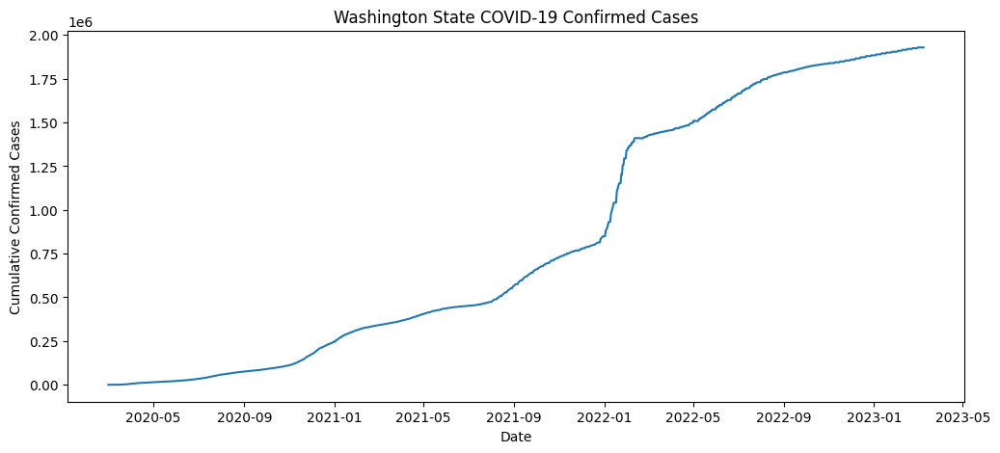
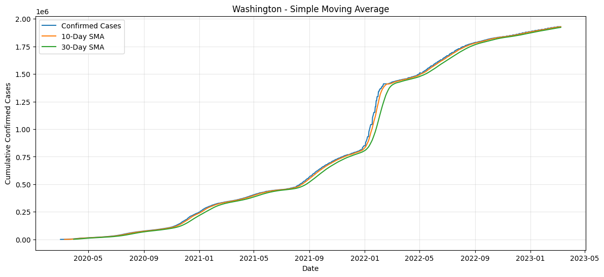
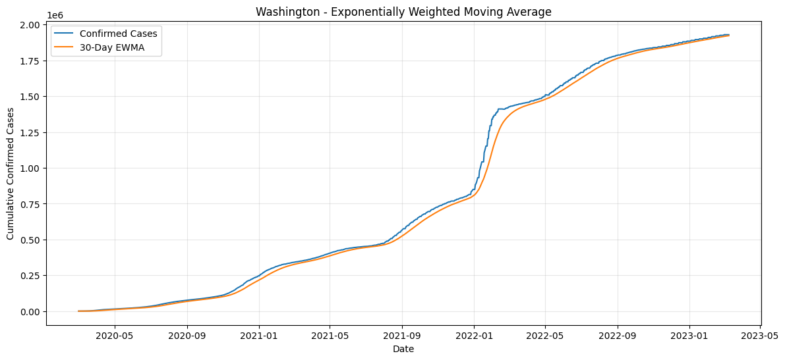
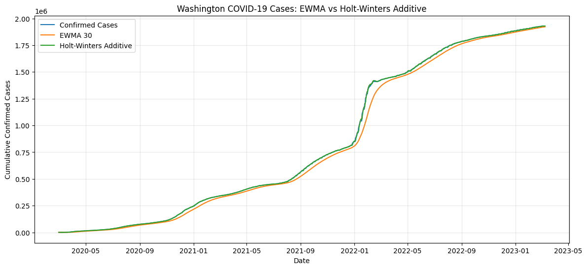
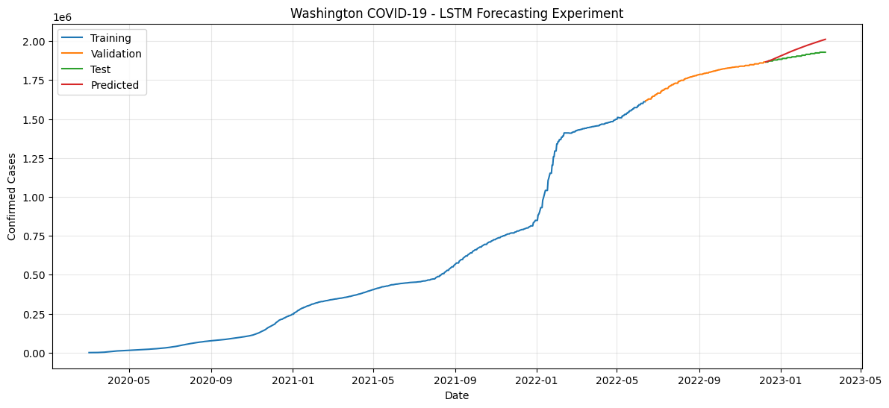

# Washington COVID-19 Time-Series Analysis

## Overview

I worked on this project to understand and reproduce the main time-series analysis used in the paper **“Enhancing COVID-19 Case Forecasting in the United States: A Comparative Analysis of ARIMA, SARIMA, and RNN Models with Grid Search Optimization.”**

For my implementation, I focused on **Washington State**. I first prepared the COVID-19 confirmed-case data, then analyzed the historical series using **SMA, EWMA, and Holt-Winters**, and finally implemented an **LSTM-based 90-day forecasting experiment**.

---

## Problem

COVID-19 case counts form a time series whose behavior changes over time. The main task is to understand how different time-series methods represent the historical trend and whether a learning-based model can use past observations to forecast future case counts.

I used cumulative confirmed COVID-19 cases for Washington and compared different modeling approaches using **MSE and RMSE**.

---

## What I Did

### 1. Data Preparation

I used the Johns Hopkins U.S. COVID-19 confirmed-case dataset.

The original dataset contains county-level records, so I:

- filtered all rows where `Province_State = Washington`;
- identified the date columns;
- summed all Washington county values for each date;
- converted the result into a simple `Date` and `ConfirmedCases` time series;
- kept observations from **March 1, 2020 to March 9, 2023**.

## Historical Time-Series Modeling

I used the following methods on the cumulative confirmed-case series:

- **SMA-10** — 10-day Simple Moving Average
- **SMA-30** — 30-day Simple Moving Average
- **EWMA-30** — Exponentially Weighted Moving Average with a span of 30
- **Additive Holt-Winters** — models level, trend, and seasonal behavior

### Results

| Model                           |               RMSE |
| ------------------------------- | -----------------: |
| **Holt-Winters Additive** | **3,867.47** |
| SMA-10                          |          14,504.19 |
| EWMA-30                         |          40,944.48 |
| SMA-30                          |          43,843.68 |

The **additive Holt-Winters model gave the lowest RMSE**, so it fitted the historical Washington cumulative case series better than the other methods in my implementation.

One implementation detail to remember: I used `seasonal_periods=30` for Holt-Winters.

## Analysis Figures

<table>
<tr>
<td width="50%" align="center">
 
<b>Washington cumulative confirmed cases</b>
</td>
<td width="50%" align="center">
 
<b>SMA-10 and SMA-30</b>
</td>
</tr>
<tr>
<td width="50%" align="center">
 
<b>EWMA-30</b>
</td>
<td width="50%" align="center">
 
<b>EWMA vs. Holt-Winters</b>
</td>
</tr>
</table>

---

## LSTM Forecasting Results

LSTM Test MSE : 2343462210.2377715
LSTM Test RMSE: 48409.3194564618

### Final LSTM Forecast Figure

 

---

## Main Findings

From the analysis I completed so far:

- Washington cumulative COVID-19 cases show several different growth periods rather than one constant trend.
- SMA smooths the data, but larger windows introduce more lag.
- EWMA reacts more strongly to recent observations than SMA.
- Additive Holt-Winters gave the best historical fit among the modeling methods I tested.
- For LSTM forecasting, using daily changes is more suitable than directly learning the cumulative level.
- Exact reproduction of the paper's LSTM result is difficult because the paper does not provide the complete architecture, preprocessing, or training configuration.

---

## Reference

**Samira Nichols and Saina Abolmaali**
*Enhancing COVID-19 Case Forecasting in the United States: A Comparative Analysis of ARIMA, SARIMA, and RNN Models with Grid Search Optimization*
medRxiv, 2024
